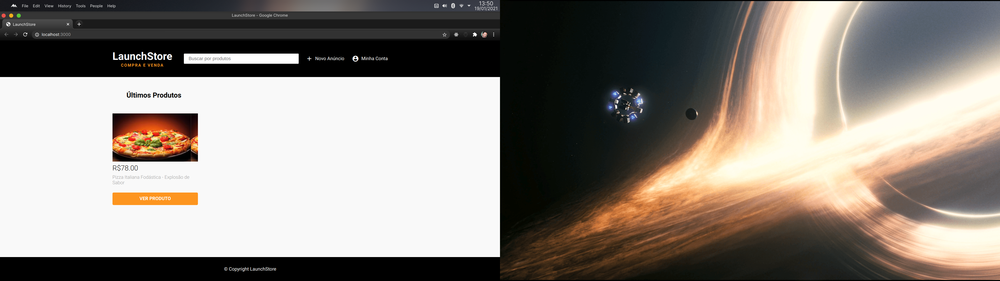
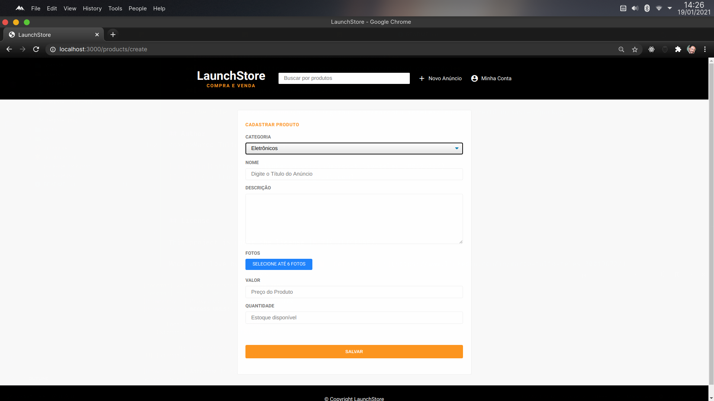
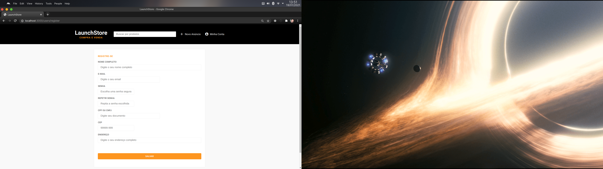
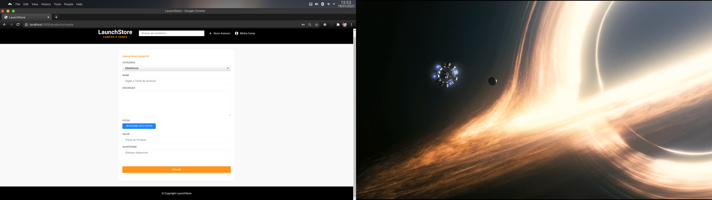

<!-- <h1 align="center">
    
</h1> -->

<h1 align="center">
   ♻️ <a href="#"> LAUNCHSTORE </a>
</h1>

<h3 align="center">
    Your best marketplace where you can buy and sell whatever you want!
</h3>

<!-- <p align="center">
  

  

  <a href="https://www.twitter.com/tgmarinho/">
    
  </a>
  
  <a href="https://github.com/tgmarinho/README-ecoleta/commits/master">
    
  </a>
    
   
   <a href="https://github.com/tgmarinho/README-ecoleta/stargazers">
    
  </a>

  <a href="https://rocketseat.com.br">
    
  </a>
  
  <a href="https://blog.rocketseat.com.br/">
    
    </a> 
</p> -->


<h4 align="center"> 
	 Status: Building...
</h4>

<p align="center">
 <a href="#about">About</a> •
 <a href="#features">Features</a> •
 <a href="#layout">Layout</a> • 
 <a href="#how-it-works">How it works</a> • 
 <a href="#tech-stack">Tech Stack</a> • 
 <a href="#contributors">Contributors</a> • 
 <a href="#author">Author</a> • 
 <a href="#user-content-license">License</a>

</p>

## About

Launchstore - is a web marketplace where you can offer products to sell or buy it from other users.
Project developed during ** Bootcamp - LaunchBase ** offered by [Rocketseat](https://blog.rocketseat.com.br/primeira-next-level-week/). LaunchBase is an online bootcamp with lots of practical content, challenges and hacks teached to new developers who wants to improve in their careers or reinforce their knowledge about web software development.

---

## Features

- [x] Users (buyers or sellers) can register on the web platform by sending:
   - [x] name
   - [x] email
   - [x] CPF or CNPJ
   - [x] address 

- [x] Users can announce their products to sell it

- [x] Users can buy any product available

- [x] Users can update their products ads anytime

- [x] The application do the management of all data information about the products (images, description details, storage, etc)

### Screenshots

<p align="center" style="display: flex; align-items: flex-start; justify-content: center;">
  

  

  
  
  
  
  
</p>

### Pre-requisites

Before you begin, you will need to have the following tools installed on your machine:
[Git] (https://git-scm.com), [Node.js] (https://nodejs.org/en/).
In addition, it is good to have an editor to work with the code like [VSCode] (https://code.visualstudio.com/)

#### Rodando o Backend (servidor)

```bash

# Clone this repository
$ git clone https://github.com/marcotulioteles/launchstore.git

# Access the project folder cmd/terminal
$ cd launchstore

# install the dependencies
$ npm install

# Run the application
$ npm start

# The server will start at port: 3000 - go to http://localhost:3000

```